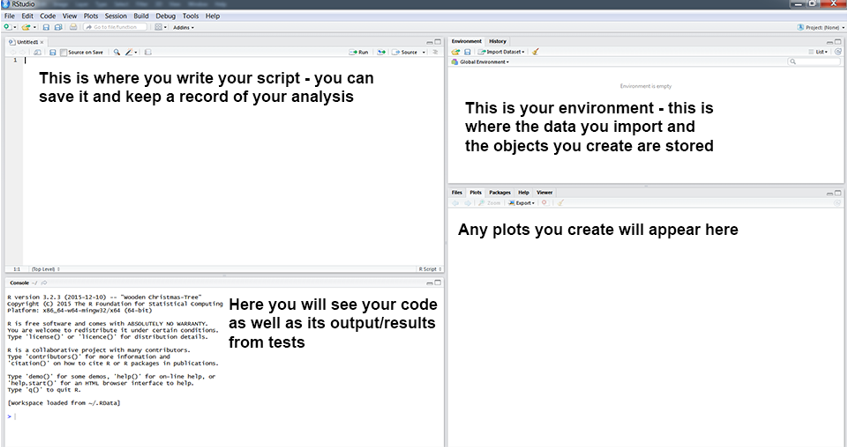
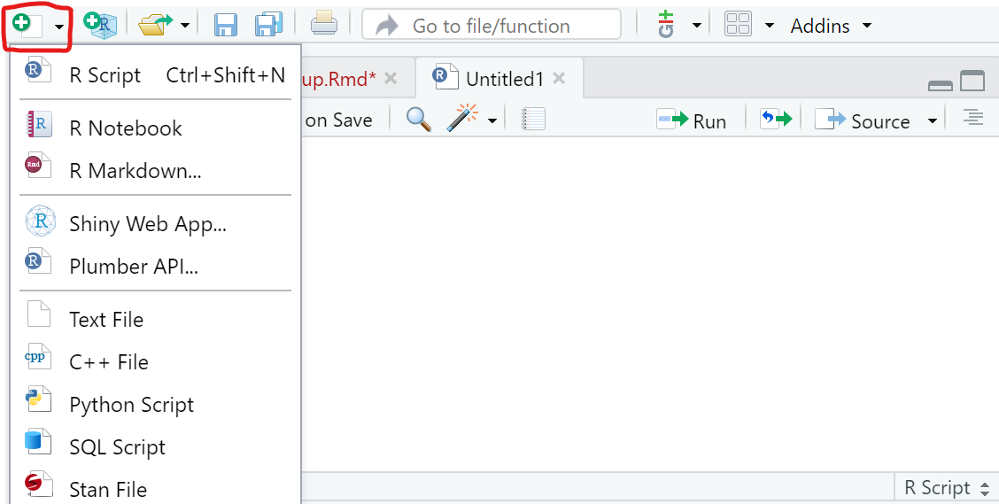

## Your Background

What do you know already?

- Excel, Numbers, Some sort of spreadsheet software

- SAS, SPSS, Minitab

- Any other programming language

- A text editor

- R

---

## Installing R

Hopefully this is done already.  If not, for Windows or OS X:

- Go to http://www.r-project.org/

- Click the CRAN link on the left, and pick a download site (0-Cloud is a good choice)

- Choose link based on your OS

- On Windows, choose the "base" subdirectory to install R.

- On OS X, choose the .pkg file to install R.

---

## Installing RStudio

This should also be done already, but if not...

- Browse to https://www.rstudio.com/

- Click on the "Download RStudio" 

- Download RStudio Desktop Free

- Choose the installer appropriate for your platform

- If you are using a Mac, you may need to download XQuartz from https://www.xquartz.org/
  + If you run into issues, try downloading this to see if it helps.

---

# Let's take a look at RStudio together...



---

#Creating a R File

+ Creates a R File that you are able to save and edit




---

# Project Management

- Important to understand your file structure and where you save everything
- Working directory 
 + "Default location where R will look for files you want to load and where it will put any files you save" [source](https://intro2r.com/work-d.html)

```{r, eval = FALSE}

#Returns the file path of the current working directory
getwd()

#Set Working Directory
setwd()

```


+ Easier way to set Working Directory: 
  - Session -> Set Working Directory -> Choose Directory
  - Point and Click Method

---

## Project Management: R Projects

- What is R Projects?
  + When working on your research it is beneficial to keep all associated files with a project together. 
  + Sets your working directory for you
- How to Create One?
  + File -> New Project -> New Directory -> New Project
  + If already have a folder created: File -> New Project -> Existing Directory 
  + This will take you to a page where you create a folder and then the file path to that folder (subdirectory)

[Reference for creating RStudio Projects](https://r4ds.had.co.nz/workflow-projects.html#rstudio-projects) $\\$
[RStudio Projects Website](https://support.rstudio.com/hc/en-us/articles/200526207-Using-RStudio-Projects)


---
class: inverse
## Your Turn: Create a Project Together for this Workshop

- Create a RStudio Project for the workshop that you can use throughout the week. 
  + You can save R files along with the datasets, so you won't have to set your working directory each day.
- Save [2-MotivatingExample.R](/01-r-intro/code/2-MotivatingExample.R) from the [website](https://srvanderplas.github.io/rwrks/01-r-intro/index.html) in your project
  + This is the file we are going to use in the next section
