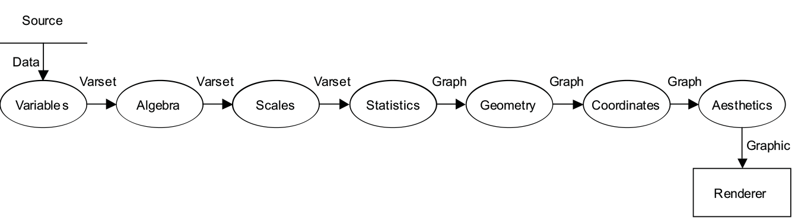
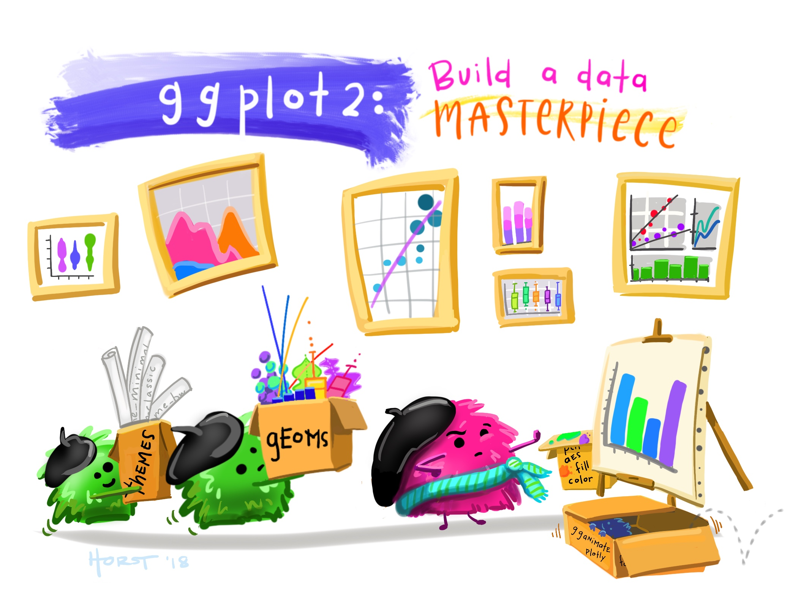

```{r setup, include=FALSE}
options(htmltools.dir.version = FALSE)
knitr::opts_chunk$set(
	echo = FALSE,
	message = FALSE,
	warning = FALSE,
	cache = TRUE
)
```

```{r setup2, cache = F}
library(dplyr)     # data wrangling
library(tidyr)     # data wrangling
library(ggplot2)   # creates plots
library(ggsci)     # color palette
library(gridExtra) # display multiple ggplots together
library(patchwork) # display multiple ggplots together
library(grid)      # create data sets

grid_arrange_shared_legend <- function(..., ncol = length(list(...)), nrow = 1, position = c("bottom", "right")) {

  plots <- list(...)
  position <- match.arg(position)
  g <- ggplotGrob(plots[[1]] + theme(legend.position = position))$grobs
  legend <- g[[which(sapply(g, function(x) x$name) == "guide-box")]]
  lheight <- sum(legend$height)
  lwidth <- sum(legend$width)
  gl <- lapply(plots, function(x) x + theme(legend.position="none"))
  gl <- c(gl, ncol = ncol, nrow = nrow)

  combined <- switch(position,
                     "bottom" = arrangeGrob(do.call(arrangeGrob, gl),
                                            legend,
                                            ncol = 1,
                                            heights = unit.c(unit(1, "npc") - lheight, lheight)),
                     "right" = arrangeGrob(do.call(arrangeGrob, gl),
                                           legend,
                                           ncol = 2,
                                           widths = unit.c(unit(1, "npc") - lwidth, lwidth)))
  
  grid.newpage()
  grid.draw(combined)

  # return gtable invisibly
  invisible(combined)

}

```

class: center, middle

.center[


R knowledge rollercoaster, by [Allison Horst](https://www.allisonhorst.com/)
]

---
class: center, middle

# MOTIVATION

---

# Why visualize?

What are graphics useful for?
+ Data cleaning
+ Exploring data structure
+ Communicating Information

Visualization offers an alternative way of communicating numbers

.center[


[Napoleon March Map](https://en.wikipedia.org/wiki/Charles_Joseph_Minard) by Charles Joseph Minard
]

???
One of the main reasons for visualization is to communicate information.

In 1812, Napoleon marched to Moscow in order to conquer the city. It was a disaster: having started with around 470,000 soldiers, he returned with just 10,000. This chart tells the story of that campaign and has become one of the most famous visualizations of all time. The map details the out-and-back journey of Napoleon’s troops. The width of the line represents the total number of soldiers and the color represents the direction (yellow for towards Moscow, black for the return trip). Below the central visualization is also a simple temperature line graph illustrating the rapidly dropping winter cold. It is effective, detailed, and paints a staggering picture of the journey’s devastation. 

---

# Tables and lists vs. Charts and graphs


```{r}
data(iris)
iris[c(1:3,50:53, 100:103),] %>% knitr::kable(row.names = F)
```

???

**Consider this thought experiment:** You have a simple data set - 2 variables, 500 observations. You want to get a sense of how the variables relate to each other. You can do one of the following options:

1. Print out the data set
2. Create some summary statistics of each variable and perhaps the covariance between the two variables
3. Draw a scatter plot of the two variables

Which one would you rather use? Why?

Here we see the iris data set in table format - contains measurements (sepal length, sepal width, petal length, and petal width) about 3 different iris species. Looking at the table, we can not easily process the relationship between the measurements and species.

---

# Tables and lists vs. Charts and graphs

.center[

]


???
One way to explore this relationship is to display the information in the data set in a graphical format. Here we assign different variables in the data set to certain attributes on the chart. For example, we might plot the sepal length and width on the x and y axes respectively and then color the points by the species.

---

# Tables and lists vs. Charts and graphs

```{r motivating-example, fig.height=6, fig.width=10, fig.align = "center"}
data(iris)
ggplot(data = iris) + 
  geom_point(aes(x = Sepal.Length, y = Sepal.Width, colour = Species), size = 2.5) +
  theme(axis.text = element_text(size = 14),
        axis.title = element_text(size = 14),
        legend.text = element_text(size = 14),
        legend.title = element_text(size = 14)) +
  scale_color_locuszoom()
```

Visualizations can aid communication and make the data easier to perceive

???
We can now process and understand the relationship between the sepal size and species through graphical format. We can now clearly see that the setosa species (red) has a short sepal length with a long sepal width while the versicolor and virginica generally have both short or both long sepal widths and lengths resepectively. 

---
class: center, middle, inverse

# Survey of types of graphs

## [The Data Vis Project](https://datavizproject.com/)
## [Data Visualization Catalogue](https://datavizcatalogue.com/)

???
It is useful to know of the different types of graphs out there. These two links, also found on the workshop webpage provide a resource for selecting the appropriate chart for your data.

---
# Beginner

.pull-left[
**One Variable**
- Discrete
  - Bar Chart
  - Pie Chart
  
- Continuous
  - Stem and Leaf Plots
  - Box and Whisker Plots
  - Histograms
  
]

.pull-right[
**Two variables**
- Continuous X, Continuous Y
  - Scatterplots
  
- Maps
]

```{r beginner-plots, fig.height=4, fig.width=20, fig.pos="center"}
# bar chart
data(mtcars)
p1 <- ggplot(mtcars, aes(x = factor(cyl), fill = factor(cyl))) + 
  geom_bar() + 
  scale_x_discrete("Cylinder") +
  ggtitle(label = "Bar Chart") +
  scale_fill_grey(name = "Cylinder", start = 0.2, end = 0.8) +
  theme(legend.position = "none")

# pie chart
p2 <- ggplot(mtcars, aes(x = factor(1), fill = factor(cyl))) + 
  geom_bar(width = 1) + 
  coord_polar(theta ="y") + 
  scale_x_discrete(name = "") +
  ggtitle(label = "Pie Chart") +
  scale_fill_grey(name = "Cylinder", start = 0.2, end = 0.8) +
  theme(legend.position = "none")

# histogram
p3 <- ggplot(iris, aes(x = Sepal.Length)) + 
  geom_histogram(bins = 20, color = "black", fill = "gray") + 
  scale_x_continuous(name = "") +
  ggtitle(label = "Histogram")

# scatterplot
p4 <- ggplot(iris, aes(x = Sepal.Length, y = Sepal.Width)) + 
  geom_point() + 
  scale_x_continuous(name = "") +
  scale_y_continuous(name = "") +
  ggtitle(label = "Scatterplot")

# map
data <- data.frame(murder=USArrests$Murder, state=tolower(rownames(USArrests)))
map <- map_data("state")
map2 <- map %>% filter(region == "nebraska")
p5 <- data %>% 
  filter(state == "nebraska") %>% 
  ggplot() + 
  geom_map(aes(map_id = state), map = map2, fill = "grey33") + 
  expand_limits(x = map2$long, y = map2$lat) +
  ggtitle(label = "Map")

grid.arrange(p1, p2, p3, p4, p5, ncol = 5, nrow = 1)

```

???
Here are some common charts most often seen. A bar chart or pie cart are used for displaying information about one discrete variable (count, proporton, mean for that group, etc.). Stem and Leaf Plots, Box and Whisker Plots, and Histograms are all useful for understanding the distribution of a single continuous variable. Scatterplots are a simple and effective way of understanding the relationship between two continuous variables and Maps can help us understand the spatial relationship between spatial information.

---
# Intermediate

- Parallel Coordinate Plots
- Mosaic Plots
- Radar Charts
- Heat Maps

<br/>
<br/>
<br/>
<br/>

```{r intermediate-plots, fig.height=4, fig.width=20, fig.pos="center", message = FALSE, warning = FALSE}
# parallel coordinate plot
iris2 <- iris %>% 
  mutate(obs = 1:nrow(iris)) %>%
  pivot_longer(cols = c("Sepal.Length", "Sepal.Width", "Petal.Length", "Petal.Width"),
               names_to = "variable",
               values_to = "value")

i2 <- ggplot(data = iris2) + 
 geom_line(aes(x = variable, y = value, group = interaction(Species, obs), color = Species)) + 
  scale_colour_grey(start=0.2, end= 0.7) + 
  theme(legend.position = "none") + 
  labs(x="", y="", title="Parallel Coordinates")

# mosaic plot
library(ggmosaic)
i3 <- ggplot(diamonds) + 
  ggmosaic::geom_mosaic(aes(x=ggmosaic::product(color), fill = cut)) +
  scale_fill_grey(start=0.2, end= 0.7) + 
  theme(legend.position = "none") + 
  labs(x="", y="", title="Mosaic Plot")

# radar chart
devtools::install_github("ricardo-bion/ggradar")
library(ggradar)
mtcars %>%
    tibble::rownames_to_column(var = "group") %>% 
     mutate_at(-1, funs(scales::rescale)) %>%
     tail(4) %>% select(1:10) -> mtcars_radar

i4 <- ggradar(mtcars_radar, group.line.width = .7,
   group.point.size = 2, axis.label.size = 3.5, grid.label.size = 2.5, background.circle.transparency = 0.1, plot.legend = FALSE)+
   scale_colour_grey(start=0.4, end= 0.9)+ theme(legend.position = "none") + 
   labs(x="", y="", title="Radar Charts")

# heat map
df.team_data <- expand.grid(teams = c("Team A", "Team B", "Team C", "Team D"), 
                            metrics = c("Metric 1", "Metric 2", "Metric 3", "Metric 4", "Metric 5")
                            )

# add variable: performance
set.seed(41)
df.team_data$performance <- rnorm(nrow(df.team_data))

i5 <- ggplot(data = df.team_data, aes(x = metrics, y = teams)) +
  geom_tile(aes(fill = performance)) + 
  scale_fill_distiller(palette = "Greys") + 
  theme(legend.position = "none") + 
  labs(x="", y="", title="Heat Map")

grid.arrange(i2, i3, i4, i5, ncol = 4, nrow = 1)
```

???
There are many other kinds of plots that can be useful for exploring relationships of variables. Parallel Coordinate plots (quantitative - discrete) each row in a data set as a line or profile across the columns/variables in the data set. Mosaic plots are useful for visualizing the relationship between two discrete variables. Radar Charts are equivalent to parallel coordinate plots with the axes arranged in polar coordinates. Heat maps are useful for communicating 3D information by showing the magnitude of a phenomenon as color in two dimensions.

---
# Advanced

- Density Plots
- Violin Plots
- Social Network Plots

<br/>
<br/>
<br/>
<br/>

```{r advanced-plots, fig.height=4, fig.width=18, fig.pos="center"}
# density plot
a1 <- ggplot(diamonds, aes(x = depth)) +
    geom_density(aes(fill = cut), alpha = .8) +
    scale_x_continuous("", limits = c(55,70)) +
    scale_y_continuous("") +
    ggtitle("Density Plot") +
    scale_colour_grey(start=0.6, end= 0.9) + 
    scale_fill_grey(start=0.6, end= 0.9) + 
    theme(legend.position = "none")

# violin plot
a2 <- ggplot(diamonds, aes(x = cut, y = price)) + 
  geom_violin(aes(fill = cut), alpha = .8) + 
  scale_x_discrete("") +
  scale_y_continuous("") +
  ggtitle("Violin Plot") +
  scale_fill_grey(start=0.6, end= 0.9) + 
  theme(legend.position = "none")

# network plot
library(GGally)
data(blood)

edges <- cbind(as.character(blood$edges$from), as.character(blood$edges$to))
codes <- unique(c(blood$edges$from, blood$edges$to))  # All available blood type codes
A <- matrix(0, nrow=length(codes), ncol=length(codes), dimnames=list(codes, codes))
A[edges] <- 1

a3 <- ggnet2(A, 
             node.size = 14, 
             node.color = "gray",
             node.label = codes,
             edge.size = 0.5, 
             edge.color = "gray") +
  theme_net() +
  theme(legend.position = "none") +
  ggtitle(label = "Network Plot")

# devtools::install_github("sctyner/geomnet")
# library(geomnet)
# a3 <- ggplot(data = blood$edges, aes(from_id = from, to_id = to)) +
#   geom_net(vertices = blood$vertices, aes(colour=..type..)) +
#   theme_net() +
#   scale_colour_grey(start=0.4, end= 0.9) + 
#   theme(legend.position = "none") + 
#   scale_x_continuous(name = "") +
#   scale_y_continuous(name = "") +
#   ggtitle(label = "Network Plot")

grid.arrange(a1, a2, a3, ncol = 3, nrow = 1)
```

???
Density and Volin plots help us explore the distribution of different variables. Social Network Plots help you investigate social structures through the use of networks and graph theory.
  
---
class: center, middle, inverse
# Grammar of Graphics

---
# Grammar of Graphics

What is the [grammar of graphics](https://link.springer.com/book/10.1007/0-387-28695-0)?

- Developed by Leland Wilkinson, is a set of grammatical rules for creating perceivable graphs

- Rather than thinking about a limited set of graphs, think about graphical forms

- Charts are instances of much more general objects
  
- An abstraction which makes thinking, reasoning, and communicating graphics easier


???
We often talk about types of graphs – bar plots, pie charts, scatterplots – as though they are unrelated, but most graphs share many aspects of their structure. 

We can think of graphs as visual representations of (possibly transformed) data, along with labels (like axes and legends) that make the meaning clear.

Much like the grammar of a language allows you to combine words into meaningful sentences, a grammar of graphics provides a structure to combine graphical elements into figures that display data in a meaningful way. 

The grammar of graphics was developed in order to produce a flexible system that can create a rich variety of charts as simply as possible, without duplication of methods.

A grammar provides a strong foundation for understanding a diverse range of graphics. A grammar may also help guide us on what a well-formed or correct graphic looks like, but there will still be many grammatically correct but nonsensical graphics

Graphics are viewed as a mapping **from variables** in the data set **to visual attributes** on the chart.

---
# Grammar of Graphics

Different types of graphs may appear completely distinct, but in actuality share many common elements.

By making different visual choices, you can use graphs to highlight different aspects of the same data. 

For example, here are three ways of displaying the same data:

```{r plots-3, fig.align='bottom', fig.height=5, fig.width=15}
data(diamonds)

# bar chart
gg1 <- ggplot(diamonds, aes(cut, fill=cut)) + 
  geom_bar() + 
  scale_x_discrete("") +
  ggtitle(label = "Bar Chart", subtitle = "Cartesian coordinates") +
  scale_fill_locuszoom() +
  theme(aspect.ratio = 1)

# stacked bar chart
gg2 <- ggplot(diamonds, aes(x = factor(1), fill=cut)) + 
  geom_bar(width = 1) + 
  scale_x_discrete("") +
  ggtitle(label = "Fill-Bar", subtitle = "Cartesian coordinates") +
  scale_fill_locuszoom() +
  theme(aspect.ratio = 1)

# pie chart
gg3 <- ggplot(diamonds, aes(x = factor(1), fill=cut)) + 
  geom_bar(width=1) + 
  coord_polar(theta = "y") + 
  scale_x_discrete("") +
  ggtitle(label = "Fill-Bar", subtitle = "Polar coordinates") +
  scale_fill_locuszoom() +
  theme(aspect.ratio = 1)

grid.arrange(gg1, gg2, gg3, ncol = 3, nrow = 1)
```


???
Different types of graphs may, at first glance, appear completely distinct. But in fact, graphs share many common elements, such as coordinate systems and using geometric shapes to represent data. 

By making different visual choices (Cartesian or polar coordinates, points or lines or bars to represent data), you can use graphs to highlight different aspects of the same data. For example, here are three ways of displaying the same data:

Each of these charts display the count of diamonds of each cut in the data set. The first chart (bar-chart) displays a bar for each cut where the length of the bar resembles the number of diamonds in that cut. The second chart (fill-bar, aka stacked bar-chart) displays one bar sectioned into the different cuts by color. The third chart (fill-bar, pie chart) displays the stacked bar-chart in polar coordinates where the sections again represent the different cuts. Later we will discuss benefits and pitfalls of the different types of charts.

---

# Grammar of Graphics

Statistical graphic specifications are expressed in six statements:

1) **DATA**: a set of data operations that create variables from datasets

2) **TRANS**: variable transformations

3) **SCALE**: scale transformations

4) **COORD**: a coordinate system

5) **ELEMENT**: graphs (points) and their aesthetic attributes (color)

6) **GUIDE**: one or more guides (axes, legends, etc.)


???
The internal processes that constitute the syntax of the grammar of graphics
<br/>
<br/>


a data flow diagram that shoes what the stages are, how they must be ordered, and what data are required along the way

provides us the ingredients and the dependencies among them, but it does not tell us how to assemble the ingredients

The Recipe:

1. Create variables – extract data into variables
2. apply algebra –
3. apply scales – ex. categorical
4. compute statistics
5. construct geometry
6. apply coordinates - ex. for polar: send (x,y) to (r, theta)
- by postponing the coordinnates operation as late in the pipeline as possible, we have made the system more flexible
7. compute aesthetics
- aesthetic functions translate a graph into a graphic, which is a set of drawing instructions for a renderer
ex. position, color, label


---

# Limitations to the Grammar

- tells us what words make up our graphical “sentences,” but offers no advice on how to write well

- is not about good taste, practice, or graphic design

- while very useful, the grammar is not all encompassing

- does not include interactive graphics

- does not include a few interesting and useful charts


---
class: center, middle, inverse

# ggplot2
## A layered grammar of graphics
.center[

]

---
## A layered grammar vs The Grammar of Graphics

ggplot2 is based on The Grammar of Graphics

.center[

]
In both grammars, the components are independent, meaning that we can generally change a single component in isolation

---

# What is a graphic?

ggplot2 uses the idea that you can build every graph with graphical components from three sources

  1. the **data**, represented by **geoms** 
  
  2. the **scales** and **coordinate system**
  
  3. the **plot annotations**
  
- to display values, map variables in the data to visual properties of the geom (**aesthetics**) like **size**, **color**, and **x** and **y** locations


---
# ggplot2: A layered grammar

The layered grammar defines the components of a plot as:

1. a default data set and set of mappings from variables to aesthetics 

2. one or more layers, each layer having one geometric object, one statistical transformation, one position adjustment, and optionally, one data set and set of aesthetic mappings  

3. one scale for each aesthetic mapping used  

4. a coordinate system 

5. the facet specification 
.pull-right[


]

???

---

# What is a Layer?


- it determines the physical representation of the data
  
- a plot may have multiple layers
  - usually all the layers on a plot have something in common, i.e. different views of the same data
    
- a layer is composed of four parts:
    1. data and aesthetic mapping
    2.  a statistical transformation (stat)
    3. a geometric object (geom)
    4. a position adjustment

---

# ggplot2: Specifications

A plot consists of several mostly independent specifications:

1. **aesthetics** - links between data variables and graphical features (position, color, shape, size)
2. **layers** - geometric elements (points, lines, rectangles, text, …)
3. **transformations** - transformations specify a functional link between the data and the displayed information (identity, count, bins, density, regression). Transformations act on the variables.
4. **scales** - scales map values in data space to values in the aesthetic space. Scales change the coordinate space of an aesthetic, but don’t change the underlying value (so the change is at the visual level, not the mathematical level).
5. **coordinate system** - e.g. polar or Cartesian
6. **faceting** - facets allow you to split plots by other variables to produce many sub-plots.
7. **theme** - formatting items, such as background color, fonts, margins…

---

# ggplot2: A layered grammar

```{r gg-layers, fig.align='top', fig.height=5, fig.width=15}
grid.arrange(gg1, gg2, gg3, ncol = 3, nrow = 1)
```

<style>
.column-left{
  float: left;
  width: 32%;
  text-align: left;
}
.column-center{
  display: inline-block;
  width: 34%;
  text-align: left;
}
.column-right{
  float: right;
  width: 32%;
  text-align: left;
}
</style>

<div class="column-left">

<p style="font-size:14px">
data: diamonds  </br>
layer:  </br>
  - aes: x = cut, y = count, fill = cut  </br>  
  - geom: bar    </br>
coordinates: Cartesian
</p>

</div>
<div class="column-center">

<p style="font-size:14px">
data: diamonds  </br>
layer:  </br>
  - aes: x = 1, y = count, fill = cut  </br>
  - geom: fill-bar  </br>
coordinates: Cartesian  </br>
</p>

</div>
<div class="column-right">

<p style="font-size:14px">
data: diamonds  </br>
layer:  </br>
  - aes: x = 1, y = count, fill = cut  </br>
  - geom: fill-bar  </br>
coordinates: Polar  </br>
</p>
</div>

---
.center[


Building a masterpiece, by [Allison Horst](https://www.allisonhorst.com/)
]

---

class: center, middle, inverse

# Make your first figure

---
# R package and data set

```{r echo = TRUE, eval = F}
library(ggplot2) #<<
head(diamonds) #<<
```

```{r echo = F, eval = T}
library(ggplot2)
head(diamonds) %>% knitr::kable()
```

---

# We begin with the data

```{r, fig.width=10, fig.height=5, echo = TRUE}
ggplot(data = diamonds) #<<
```

---

# Then we specify the aesthetic mappings

```{r, eval=FALSE, fig.height=5, fig.width=10, echo = TRUE}
ggplot(data = diamonds, aes(x = carat, y = price)) #<<

```

```{r, echo=FALSE, fig.height=5, fig.width=10}
ggplot(data = diamonds, aes(x = carat, y = price))+ scale_fill_locuszoom()
```
???
or what relationships we want to see
---

# Then we choose a geom

```{r, eval=FALSE, fig.width=10, fig.height=5, echo = TRUE}
ggplot(data = diamonds, aes(x = carat, y = price)) +
    geom_point() #<<
```

```{r, echo=FALSE, fig.width=10, fig.height=5}
ggplot(data = diamonds, aes(x = carat, y = price)) +
    geom_point() + 
    scale_color_locuszoom()
```

---

# And add an aesthetic

```{r, eval=FALSE, fig.width=10, fig.height=5, echo = TRUE}
ggplot(data = diamonds, aes(x = carat, y = price)) +
    geom_point(aes(colour = cut)) #<<
```

```{r, echo=FALSE, fig.width=10, fig.height=5}
ggplot(data = diamonds, aes(x = carat, y = price)) +
    geom_point(aes(colour = cut)) + 
    scale_color_locuszoom()
```

---
# And add another layer...

```{r, eval = FALSE, fig.width=10, fig.height=5, echo = TRUE}
ggplot(data = diamonds, aes(x = carat, y = price)) +
    geom_point(aes(colour = cut)) +
    geom_smooth() #<<
```

```{r, echo = FALSE, fig.width=10, fig.height=5}
ggplot(data = diamonds, aes(x = carat, y = price)) +
    geom_point(aes(colour = cut)) +
    geom_smooth() + 
    scale_color_locuszoom()
```

---

# Mapping aesthetics vs setting aesthetics

```{r, fig.width=10, fig.height=5, eval = FALSE, echo = TRUE}
ggplot(data = diamonds, aes(x = carat, y = price) +
    geom_point(aes(colour = cut), size = 2, alpha = .5) + #<<
    geom_smooth(aes(fill = cut), colour = "lightgrey") #<<
```

```{r, fig.width=10, fig.height=5, echo = FALSE}
ggplot(data = diamonds, aes(x = carat, y = price)) +
    geom_point(aes(colour = cut), size = 2, alpha = .5) + 
    scale_color_locuszoom() + 
    scale_fill_locuszoom() +
    geom_smooth(aes(fill = cut), colour = "lightgrey")
```

---

# Coordinate transformations can be specified

```{r, fig.width=10, fig.height=5, eval = FALSE, echo = TRUE}
ggplot(data = diamonds, aes(x = carat, y = price)) +
    geom_point(aes(colour = cut), size = 2, alpha = .5) +
    geom_smooth(aes(fill = cut), colour = "lightgrey") +
    scale_y_log10() #<<
```

```{r, fig.width=10, fig.height=5, echo = FALSE}
ggplot(data = diamonds, aes(x = carat, y = price)) +
    geom_point(aes(colour = cut), size = 2, alpha = .5) +
    geom_smooth(aes(fill = cut), colour = "lightgrey") +
    scale_color_locuszoom() + 
    scale_fill_locuszoom() + 
    scale_y_log10()
```


---

# As can facet variables

```{r, fig.width=10, fig.height=5, eval = FALSE, echo = TRUE}
ggplot(data = diamonds, aes(x = carat, y = price)) +
    geom_point(aes(colour = cut), size = 2, alpha = .5) +
    geom_smooth(aes(fill = cut), colour = "lightgrey") +
    scale_y_log10() +
    facet_wrap(~cut) #<<
```

```{r, fig.width=10, fig.height=5, echo = FALSE}
ggplot(data = diamonds, aes(x = carat, y = price)) +
    geom_point(aes(colour = cut), size = 2, alpha = .5) +
    geom_smooth(aes(fill = cut), colour = "lightgrey") +
    scale_color_locuszoom() + 
    scale_fill_locuszoom() +
    scale_y_log10() +
    facet_wrap(~cut)
```


---

class: inverse

# Today's Outline

BASICS
1. Why is data visualization important?
2. Data Types, Formats, and Structures
3. Formatting your data: A tidy data discussion

BUILDING PLOTS
1. Geoms, Stats, Coordinates, and Faceting

PERCEPTION
1. Basics of cognitive visual perception
2. What makes a good graphic?
3. Aesthetics and scales in ‘ggplot2‘

POLISHING PLOTS
1. Setting themes
2. Modifying elements of a plot  
3. Making plots interactive!
4. Saving your work


