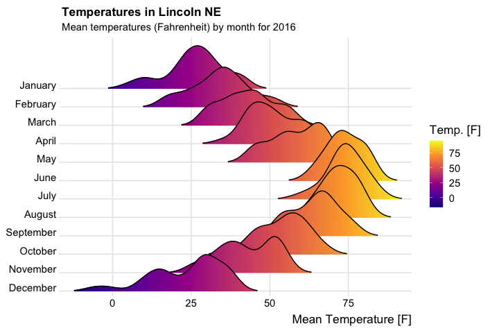
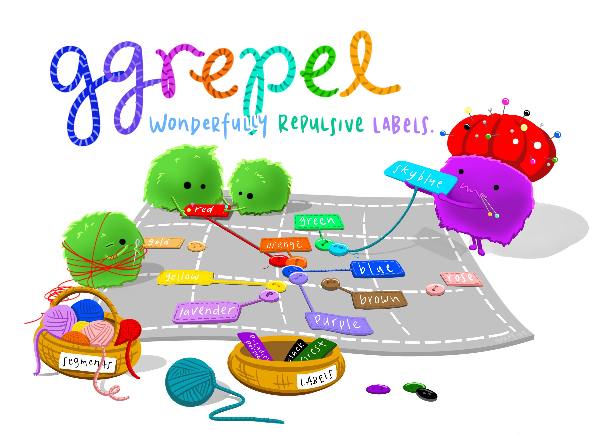

class: center, middle

```{r setup, include=FALSE}
options(htmltools.dir.version = FALSE)
knitr::opts_chunk$set(
	echo = FALSE,
	message = FALSE,
	warning = FALSE,
	cache = TRUE,
	purl = FALSE
)
```

```{r, echo=FALSE}
library(ggplot2)
library(ggsci)
library(ggthemes)
library(gridExtra)
library(patchwork)
library(grid)

grid_arrange_shared_legend <- function(..., ncol = length(list(...)), nrow = 1, position = c("bottom", "right")) {

  plots <- list(...)
  position <- match.arg(position)
  g <- ggplotGrob(plots[[1]] + theme(legend.position = position))$grobs
  legend <- g[[which(sapply(g, function(x) x$name) == "guide-box")]]
  lheight <- sum(legend$height)
  lwidth <- sum(legend$width)
  gl <- lapply(plots, function(x) x + theme(legend.position="none"))
  gl <- c(gl, ncol = ncol, nrow = nrow)

  combined <- switch(position,
                     "bottom" = arrangeGrob(do.call(arrangeGrob, gl),
                                            legend,
                                            ncol = 1,
                                            heights = unit.c(unit(1, "npc") - lheight, lheight)),
                     "right" = arrangeGrob(do.call(arrangeGrob, gl),
                                           legend,
                                           ncol = 2,
                                           widths = unit.c(unit(1, "npc") - lwidth, lwidth)))
  
  grid.newpage()
  grid.draw(combined)

  # return gtable invisibly
  invisible(combined)

}

```

# BUILDING PLOTS

---
class: inverse, center, middle

# Underlying theory

---

# What is a graphic?

ggplot2 uses the idea that you can build every graph from the same components:

  1. a **data** set
  
  2. a **coordinate system**
  
  3. **geoms** - visual marks that represent data
  
- to display values, map variables in the data to visual properties of the geom (**aesthetics**) like **size**, **color**, and **x** and **y** locations


---
# How to build a graph

Complete the template below to build a graph

<br>
.center[

]


---
# How to build a graph

`ggplot(data = mpg, aes(x = class, y = hwy))`

- This will begin a plot that you can finish by adding layers to.

- You can add one geom per layer

```{r plots-4, fig.align='bottom', fig.height=5, fig.width=15}
p1 <- ggplot(data = mpg, aes(x = class, y = hwy)) + 
  ggtitle(label = "") +
  theme(plot.title = element_text(size = 22))

p2 <- ggplot(data = mpg, aes(x = class, y = hwy)) + 
  geom_boxplot() + 
  ggtitle(label = "+ geom_boxplot()") +
  theme(plot.title = element_text(size = 22))

p3 <- ggplot(data = mpg, aes(x = class, y = hwy)) + 
  geom_jitter() + 
  geom_boxplot() + 
  ggtitle(label = "+ geom_jitter() + geom_boxplot()") +
  theme(plot.title = element_text(size = 22))

grid.arrange(p1, p2, p3, ncol = 3, nrow = 1)
```

---
class: inverse
# Your Turn!

Change the code below to have the points **on top** of the boxplots.

```{r echo=TRUE, fig.height=4, fig.width=8, purl=T, fig.align = "center"}
ggplot(data = mpg, aes(x = class, y = hwy)) + 
  geom_jitter() + 
  geom_boxplot()
```

---
# What is a geom?

In ggplot2, we use a geom function to represent data points, and use the geom's aesthetic properties to represent variables.

```{r, fig.align='top', fig.height=4, fig.width=10}
p1 <- ggplot(data = mpg, aes(x = cty, y = hwy, colour = class)) + 
  geom_point() + 
  scale_color_locuszoom() + 
  scale_x_continuous(name = "city mpg") +
  scale_y_continuous(name = "highway mpg") +
  ggtitle("geom_point")

p2 <- ggplot(data = mpg, aes(x = cty, y = hwy, colour = class)) + 
  geom_text(aes(label = class)) + 
  scale_color_locuszoom() +
  scale_x_continuous(name = "city mpg") +
  scale_y_continuous(name = "highway mpg") +
  ggtitle("geom_text")

p1 + p2
```

Once our data is formatted and we know what type of variables we are working with, we can select the correct geom for our visualization. 

---
## Available [Geoms](https://github.com/rstudio/cheatsheets/blob/main/data-visualization-2.1.pdf)

.center[

]

---
# What is a layer?

- it determines the physical representation of the data

- Together, the data, mappings, statistical transformation, and geometric object form a layer

- A plot may have multiple layers
 
```{r, fig.align='bottom', fig.height=5, fig.width=15}
p1 <- ggplot(data = mpg, aes(x = class, y = hwy, colour = class)) + 
  geom_jitter(width = 0.1) + 
  scale_fill_locuszoom() + 
  scale_color_locuszoom()

p2 <- ggplot(data = mpg, aes(x = class, y = hwy, colour = class)) + 
  geom_violin(aes(fill = class), alpha = 0.4) + 
  scale_fill_locuszoom() + 
  scale_color_locuszoom()

p3 <- ggplot(data = mpg, aes(x = class, y = hwy, colour = class)) + 
  geom_jitter(width = 0.1) + 
  geom_violin(aes(fill = class), alpha = 0.4) + 
  scale_fill_locuszoom() + 
  scale_color_locuszoom()

p1 + p2 + p3
```

---
# Alternative method of building layers: Stats

A stat builds a new variable to plot (e.g., count and proportion)
.pull-left[
.center[

]].pull-right[
.center[

]]

---
# Faceting

A way to extract subsets of data and place them side-by-side in graphics
```{r, fig.width=10, fig.height=4, echo = TRUE, eval=FALSE}
ggplot(data = mpg, aes(x = cty, y = hwy, colour = class)) + 
  geom_point()
```

```{r, fig.width=10, fig.height=4, echo = TRUE, eval=FALSE}
ggplot(data = mpg, aes(x = cty, y = hwy, colour = class)) + 
  geom_point() +
  facet_grid(~class) #<<
```
.center[
```{r, fig.width=10, fig.height=3, fig.align = "center", echo=FALSE}
a <- ggplot(data = mpg, aes(x = cty, y = hwy, colour = class)) + 
  geom_point() + 
  scale_color_locuszoom() +
  theme(aspect.ratio = 1.5)

b <- ggplot(data = mpg, aes(x = cty, y = hwy, colour = class)) + 
  geom_point() +theme(legend.position = "none") +
  facet_grid(~class) + 
  scale_color_locuszoom() +
  theme(aspect.ratio = 1.5)

a + b + plot_layout(widths = c(1, 7))
```
]

---
# Faceting Options

- `facet_grid(. ~ b)`: facet into columns based on b 
- `facet_grid(a ~ .)`: facet into columns based on a 
- `facet_grid(a ~ b)`: facet into both rows and columns
- `facet_wrap( ~ fl)`: wrap facets into a rectangular layout

You can set scales to let axis limits vary across facets:

- `facet_grid(y ~ x, scales = "free")`: x and y axis limits adjust to individual facets
  - "free_x" - x axis limits adjust
  - "free_y" - y axis limits adjust

You can also set a labeller to adjust facet labels:
- `facet_grid(. ~ fl, labeller = label_both)`
- `facet_grid(. ~ fl, labeller = label_bquote(alpha ^ .(x)))`
- `facet_grid(. ~ fl, labeller = label_parsed)`

---
# Position Adjustments

Position adjustments determine how to arrange geoms that would otherwise occupy the same space
- **Dodge**: Arrange elements side by side 
- **Fill**: Stack elements on top of one another, normalize height
- **Stack**: Stack elements on top of one another

```{r position-adj, eval = F, echo = T}
ggplot(mpg, aes(fl, fill = drv)) + 
  geom_bar(position = "")` #<<
```

```{r, fig.width=12, fig.height=4, fig.align = "center"}

s <- ggplot(mpg, aes(fl, fill = drv)) + 
  ggtitle("") + 
  scale_fill_locuszoom()

s1 <- s + 
  geom_bar(position = "dodge") + 
  ggtitle("position = 'dodge'") + 
  theme(plot.title = element_text(size = 18))

s2 <- s + 
  geom_bar(position = "fill") + 
  ggtitle("position = 'fill'") + 
  theme(plot.title = element_text(size = 18))

s3 <- s + 
  geom_bar(position = "stack") + 
  ggtitle("position = 'stack'") + 
  theme(plot.title = element_text(size = 18))

s1 + s2 + s3
```

---
# Position Adjustments: Jitter

- **Jitter**: Add random noise to X & Y position of each element to avoid overplotting
- There is also a jitter geom 

```{r, fig.width=12, fig.height=4, fig.align = "center"}
p2 <- ggplot(mpg, aes(cyl, hwy, color = factor(cyl))) + 
  geom_point() + ggtitle("geom_point()") + 
  scale_color_locuszoom() + 
  theme(plot.title = element_text(size = 18))

p3 <- ggplot(mpg, aes(cyl, hwy, color = factor(cyl))) + 
  geom_point(position = "jitter") + 
  ggtitle('geom_point(position = "jitter")') + 
  scale_color_locuszoom() + 
  theme(plot.title = element_text(size = 18))

p4 <- ggplot(mpg, aes(cyl, hwy, color = factor(cyl))) + 
  geom_jitter() + ggtitle("geom_jitter()") + 
  scale_color_locuszoom() + 
  theme(plot.title = element_text(size = 18))

p2 + p3 + p4
```

---
## Coordinate Systems

- `coord_cartesian()`: The default cartesian coordinate system
- `coord_fixed()`: Cartesian with fixed aspect ratio between x & y units
- `coord_flip()`: Flipped Cartesian coordinates
- `coord_polar()`: Polar coordinates
- `coord_trans()`: Transformed cartesian coordinates.
- `coord_map()`: Map projections from the mapproj package (mercator (default), azequalarea, lagrange, etc.)

```{r, fig.width=10, fig.height=4, fig.align = "center", eval = FALSE}
r <- ggplot(mpg, aes(fl)) + geom_bar()
r + coord_cartesian(xlim = c(0, 5))
r + coord_fixed(ratio = 1/10)
r + coord_flip()
r + coord_trans(y = "sqrt")
r + coord_polar(theta = "x", direction=1 )
z + coord_map(projection = "ortho")
z + coord_map(projection = "ortho", orientation = c(-90, 0, 0))
```

```{r, fig.width=10, fig.height=5, fig.align = "center"}
r <- ggplot(mpg, aes(fl)) + geom_bar()
r1 <- r + coord_cartesian(xlim = c(0, 5)) + ggtitle("coord_cartesian")
r2 <- r + coord_fixed(ratio = 1/10) + ggtitle("coord_fixed")
r3 <- r + coord_flip() + ggtitle("coord_flip")
r4 <- r + coord_polar(theta = "x", direction=1 ) + ggtitle("coord_polar")
r5 <- r + coord_trans(y = "sqrt") + ggtitle("coord_trans")
world <- map_data("world")
library(maps)
worldmap <- ggplot(world, aes(x = long, y = lat, group = group)) +
  geom_path() +
  scale_y_continuous(breaks = (-2:2) * 30) +
  scale_x_continuous(breaks = (-4:4) * 45)
r7 <- worldmap + coord_map("ortho") + ggtitle("coord_map")
r8 <- worldmap + coord_map("ortho", orientation = c(-90, 0, 0)) + ggtitle("coord_map")

grid.arrange(r1, r2, r3, r5, r4, r7, r8, nrow = 2)
```

---
class: inverse, center, middle
# Maps in ggplot2

---
## Maps
Plotting geospatial data is a common visualization task, and one that requires specialized tools.

Typically the problem can be decomposed into two problems:

1. using one data source to draw a map

2. adding metadata from another information source to the map 

[resource](https://ggplot2-book.org/maps.html)

---
## Example: Nebraska Population

**Map Source Data**
```{r ne-map-data1, echo = T, eval = F}
ne_counties <- map_data("county", "nebraska")
```

```{r ne-map-data2, echo = F, eval = T}
ne_counties <- map_data("county", "nebraska")
ne_counties[1:2,] %>% knitr::kable()
```
 
**Population Data**
```{r ne-pop1, echo = T, eval = F}
ne_population <- read.csv("https://unl-statistics.github.io/R-workshops/02-r-graphics/data/nebraska-population.csv")
```

```{r ne-pop2}
ne_population <- read.csv("https://unl-statistics.github.io/R-workshops/02-r-graphics/data/nebraska-population.csv")
ne_population[1:2,] %>% knitr::kable()  
```

---
## Example: Nebraska Population

```{r, combine-ne-data, echo = F}
ne_data <- left_join(ne_counties, ne_population, by = "subregion") 
```

```{r ne-map, echo = T, eval = T, fig.align = 'center', fig.height = 4, fig.width = 10}
ggplot(ne_data) +
  geom_polygon(aes(x = long, y = lat, group = group, fill = log(population)), color = "black") +
  coord_map() +
  theme_void() +
  scale_fill_gradient(low = "white", high = "green4")
```

---
class:inverse, center, middle
# [ggplot2 extenstions](https://exts.ggplot2.tidyverse.org/ggiraph.html)

---
## library(ggforce)

```{r facet-zoom, eval = T, echo = T, fig.width = 8, fig.height = 5, fig.align = 'center'}
library(ggforce)
ggplot(iris, aes(Petal.Length, Petal.Width, colour = Species)) +
  geom_point() +
  facet_zoom(x = Species == 'versicolor') #<<
```

---
## library(ggvoronoi)

```{r voronoi-plot, echo = F, fig.width = 12, fig.height = 8, fig.align = 'center'}
library(dplyr)
library(ggvoronoi)

california <- map_data("state") %>% filter(region == "california")
ncdc.cali <- ncdc_locations %>% filter(state=="CA")

cali_map <-
  ggplot(data=ncdc.cali,aes(x=long,y=lat)) +
      scale_fill_gradientn("Elevation", 
          colors=c("seagreen","darkgreen","green1","yellow","gold4", "sienna"),
          values=scales::rescale(c(-60,0,1000,2000,3000,4000))) + 
      scale_color_gradientn("Elevation", 
          colors=c("seagreen","darkgreen","green1","yellow","gold4", "sienna"),
          values=scales::rescale(c(-60,0,1000,2000,3000,4000))) + 
      coord_map() +
      theme_minimal() +
      theme(axis.text=element_blank(),
            axis.title=element_blank())

cali_map +
  geom_voronoi(aes(fill=elev),outline=california)
```

---
## library(ggridges)

```{r ggridges, echo = F, eval = F}
ggplot(lincoln_weather, aes(x = `Mean Temperature [F]`, y = Month, fill = stat(x))) +
  geom_density_ridges_gradient(scale = 3, rel_min_height = 0.01, gradient_lwd = 1.) + #<<
  scale_x_continuous(expand = c(0, 0)) +
  scale_y_discrete(expand = expand_scale(mult = c(0.01, 0.25))) +
  scale_fill_viridis_c(name = "Temp. [F]", option = "C") +
  labs(
    title = 'Temperatures in Lincoln NE',
    subtitle = 'Mean temperatures (Fahrenheit) by month for 2016'
  ) +
  theme_ridges(font_size = 13, grid = TRUE) + 
  theme(axis.title.y = element_blank())
```

.center[


By [Claus O. Wilke](https://cran.r-project.org/web/packages/ggridges/vignettes/gallery.html)
]

---
## library(ggrepel)

.center[

[Allison Horst](https://www.allisonhorst.com/)
]

---
## library(patchwork)

.center[

Patchwork, by [Allison Horst](https://www.allisonhorst.com/)
]

---
## ggplot2 extensions

Check out slides for some frequently used extensions by [Ashirwad Barnwal](https://github.com/ashirwad) [**HERE**](https://isugg21-ggext.netlify.app/#1).

