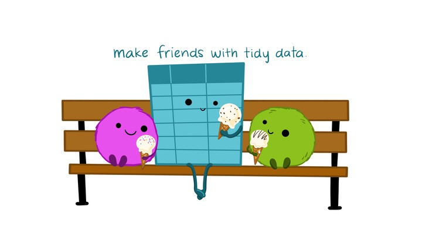
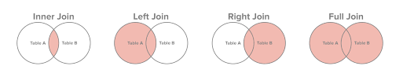

```{r setup, include=FALSE}
knitr::opts_chunk$set(echo = TRUE)
library(tidyverse)
```

## Recall - Sources of Messiness

1. Column headers are values, not variable names.<br>
e.g. *treatmenta, treatmentb* <br>

2. Multiple variables are stored in one column. <br>
e.g. *Fall 2015, Spring 2016* or *"1301 8th St SE, Orange City, Iowa 51041
(42.99755, -96.04149)", "2102 Durant, Harlan, Iowa 51537
(41.65672, -95.33780)"* <br>

3. Multiple observational units are stored in the same table.

4. A single observational unit is stored in multiple tables.

---

## Recall - Tidy data

1. Each variable forms one column.

2. Each observation forms one row.

3. Each type of observational unit forms a table.

.center[

]
<!-----
# Keys and Measurements

## Finding your keys - Example (1)

100 patients are randomly assigned to a treatment for heart attack, measured 5 different clinical outcomes.

## Finding your keys - Example (1)

100  patients are randomly assigned to a treatment for heart attack, measured 5 different clinical outcomes.

- key: patient ID
- factor variable (design): treatment
- measured variables: 5 clinical outcomes

## Finding your keys - Example (2)

Randomized complete block trial with four fields, four different types of fertilizer, over four years.  Recorded total corn yield, and fertilizer run off

## Finding your keys - Example (2)

Randomized complete block trial with four fields, four different types of fertilizer, over four years.  Recorded total corn yield, and fertilizer run off

- key: fields, types of fertilizer, year
- measurement: total corn yield, fertilizer run off


## Finding your keys - Example (3)

Cluster sample of twenty students in thirty different schools.  For each school, recorded distance from ice rink.  For each student, asked how often they go ice skating, and whether or not their parents like ice skating


## Finding your keys - Example (3)

Cluster sample of twenty students in thirty different schools.  For each school, recorded distance from ice rink.  For each student, asked how often they go ice skating, and whether or not their parents like ice skating

- key: student ID, school ID
- measurement: distance to rink, #times ice skating, parents' preference


## Finding your keys - Example (4)

For each person, recorded age, sex, height and target weight, and then at multiple times recorded their weight

## Finding your keys - Example (4)

For each person, recorded age, sex, height and target weight, and then at multiple times recorded their weight

- key: *patient ID*, date
- measurement: *age, sex, height, target weight*, current weight

*only patient ID is needed for variables in italics*
---> 
---
## Back to the **(Tidying data - Plan of attack)** List

**Messy (1)**: `tidyr` functions `pivot_longer` and `pivot_longer`.  
`pivot_longer (data,names_to,values_to, ...)`: take multiple columns and collapse into key-value pairs

`pivot_wider (data,names_from,values_from,values_fill = NA)`: spread a key-value pair across multiple columns.

**Messy (2)**: `tidyr` function `separate (data, col, into, sep = " ")`: separate one column into multiple columns

**Messy (3)**: `dplyr` : a combination of the functions discussed previously today

**Messy (4)**: `dplyr` functionality `join` (and friends) to combine multiple data sets 

---

## Back to the list starting with **Messy (3)**

Messy (3): *Multiple observational units are stored in the same table.*

What does that mean? The *key is split*, 

i.e. for some values all key variables are necessary, while other values only need some key variables.


---

## Why do we need to take care of split keys?

- Data redundancy introduces potential problems (same student *should* have the same student ID)

- to check data consistency, we split data set into parts - this process is called *normalizing*

- normalization reduces overall data size

- useful way of thinking about objects under study

---

## Tidying **Messy (3)**

Splitting into separate datasets:


---

## Now for **Messy (4)**

**Messy (4)**: Values for a single observational unit are stored across multiple tables.

After data are normalized by splitting, we want to de-normalize again by **joining** datasets.

---

## Motivating Example: Lahman package (Sports Database)

Sean Lahman is a database journalist, who started databases of historical sports statistics, in particular, the Lahman database on baseball.

```{r, warning=FALSE}
library(Lahman)
LahmanData %>% head(5) %>% knitr::kable(format = "html")
```

---

## Lahman database

The Lahman database consists of 24 data frames that are linked by `playerID`.

This is clean, but not very readable. <br>

The `People` table includes names and other attributes for each player. <br>

**Joining** multiple tables helps us to bring together (pieces of) information from multiple sources.


---

## Example: Hall of Fame of Baseball

```{r warning = FALSE, fig.height = 3.5, echo=TRUE}
HallOfFame <- HallOfFame %>%
  group_by(playerID) %>% 
  mutate(times = order(yearID)) 

HallOfFame %>%
  ggplot(aes(x = yearID, y = votes/needed, colour = inducted)) + 
  geom_hline(yintercept = 1, colour = "grey20", size = .1) +
  geom_line(aes(group = playerID), colour = "black", size = 0.2) +
  geom_point() 
```

---

## Hall of Fame - how many attempts?

We'd like to label all the last attempts - and not just with the `playerID`
```{r warning = FALSE, fig.height = 3.5, echo=TRUE}
HallOfFame %>% 
  ggplot(aes(x = times, y = votes/needed, colour = inducted)) + 
  geom_hline(yintercept = 1, colour = "grey20", size = .1) +
  geom_line(aes(group = playerID), colour = "black", size = 0.2) +
  geom_point() 
```

---

## Joins - general idea

.center[


[RStudio Conf 2020](https://rstudio-conf-2020.github.io/r-for-excel/filter-join.html)
]

---

## Joins - more specific idea

- Natural Language: I want **THIS** with **THAT** using this common variable.

- Data sets are joined along values of variables. 

- In `dplyr` there are various join functions: `left_join`, `inner_join`, `full_join`, ...

- Differences between join functions are only visible if not all values in one set have values in the other

.center[

]
---

## Simple example data
.pull-left[
```{r eval = F, echo=TRUE}
df1 <- data.frame(
  id = 1:6, 
  trt = rep(c("A", "B", "C"),
  rep=c(2,1,3)), 
  value = c(5,3,7,1,2,3))
```

```{r, echo=FALSE}
df1 <- data.frame(id = 1:6, 
                  trt = rep(c("A", "B", "C"), 
                            rep=c(2,1,3)), 
                  value = c(5,3,7,1,2,3))
df1 %>% knitr::kable(format = "html")
```
]
.pull-right[
```{r eval = F, echo=TRUE}
df2 <- data.frame(
  id=c(4,4,5,5,7,7), 
  stress=rep(c(0,1), 3),
  bpm = c(65, 125, 74, 136, 48, 110))
```

```{r, echo=FALSE}
df2 <- data.frame(id=c(4,4,5,5,7,7), 
                  stress=rep(c(0,1), 3), 
                  bpm = c(65, 125, 74, 136, 48, 110))
df2 %>% knitr::kable(format = "html")
```    
]
---

## Left join

- all elements in the *left* data set are kept

- non-matches are filled in by `NA`

- `right_join` works symmetric

```{r, echo=TRUE}
left_join(df1, df2, by="id") %>% knitr::kable(format = "html")
```

---

## Inner join

- only matches from both data sets are kept

```{r, echo=TRUE}
inner_join(df1, df2, by = "id") %>% knitr::kable(format = "html")
```

---

## Full join

- all ids are kept, missings are filled in with `NA`

```{r, echo=TRUE}
full_join(df1, df2, by = "id") %>% knitr::kable(format = "html")
```

---

## Traps of joins

- Sometimes we unexpectedly cannot match values: missing values, different spelling, ...

- Be very aware of things like a trailing or leading space

- Join can be along multiple variables, e.g. `by = c("ID", "Date")`

- Joining variable(s) can have different names, e.g. `by = c("State" = "Name")`

- Always make sure to check dimensions of data before and after a join

- Check on missing values; help with that: `anti_join`

---

## Anti join

- a neat function in `dplyr`
- careful, not symmetric!  

```{r, echo=TRUE}
anti_join(df1, df2, by="id") # no values for id in df2
anti_join(df2, df1, by="id") # no values for id in df1
```

---

## Joining baseball data from the Lahman Package

Does lifetime batting average make a difference in a player being inducted? 

```{r, warning = FALSE, fig.height=3, echo=TRUE}
Batting2 <- Batting %>% group_by(playerID) %>% 
  mutate(BatAvg = H/AB) %>% 
  summarise(LifeBA = mean(BatAvg, na.rm=TRUE))

hof_bats <- inner_join(HallOfFame %>% filter(category == "Player"),
                       Batting2, by = c("playerID"))

hof_bats %>% 
  ggplot(aes(x = yearID, y = LifeBA, group = playerID)) + 
  geom_point(aes(color = inducted))

```

---

## Joining Baseball Data (2/2)

What about pitchers? Are pitchers with lower lifetime ERAs more likely to be inducted?

```{r, fig.height=3, warning=FALSE, echo=TRUE}
Pitching2 <- Pitching %>% group_by(playerID) %>% 
  summarise(LifeERA = mean(ERA, na.rm = TRUE))

hof_pitch <- inner_join(HallOfFame %>% filter(category == "Player"), 
                        Pitching2, by = c("playerID"))

hof_pitch %>% 
  ggplot(aes(x = yearID, y = LifeERA, group = playerID)) + 
  geom_point(aes(color = inducted))

```


---
class: inverse

## Your turn

- Load the `Lahman` package into your R session.
- Join (relevant pieces of) the `People` data set and the `HallOfFame` data.
- Output the names of individuals with 15 or more attempts ("times" in the data set). Make sure to deal with missing values appropriately.

---
## Solution

```{r, echo=TRUE}
Voted <- HallOfFame %>% 
  filter(!is.na(ballots)) %>% 
  group_by(playerID) %>% 
  arrange(yearID) %>% 
  mutate( attempt = order(yearID))

Voted <- left_join(Voted, People %>% 
                dplyr::select(playerID, nameFirst, nameLast), 
                   by = "playerID") %>% filter(attempt > 15)
Names <- Voted %>% mutate(FullName = paste(nameFirst, nameLast))
Names$FullName %>% unique() %>% 
  head(3) %>% knitr::kable(format = "html")
```

---
## Data Wrangling is a Super Power

.center[

]
---
class: inverse

# Review Today's Outline

READING FILE TYPES
1. What file types can be read in with R?
2. Basics reading in different file types
3. Formatting your data: A tidy data discussion (Review from Graphics Lecture)

DPLYR PACKAGE
1. filter, mutate, select, summarise, group by, and arrange

TIDYR PACKAGES
1. What is tidy data?
2. pivot longer, pivot wider and separate functions
3. Lubridate package basics

JOINING DATASETS
1. Basic set theory logic (joining/combining datasets)


<!---
## Chart of induction

```{r warning = FALSE, fig.height = 3.5, eval = FALSE}
Voted %>% ggplot(aes(x = attempt, y = votes/needed)) +
  geom_hline(yintercept = 1, colour = "grey25", size = 0.1) +
  geom_line(aes(group = playerID), colour = "grey35", size = 0.2) + 
  geom_point(aes(colour = inducted))
```

## Getting the dataset for the labels

```{r eval = FALSE}
labels <- Voted %>% group_by(playerID) %>% summarize(
  votes = votes[which.max(attempt)],
  needed = needed[which.max(attempt)],
  attempt = max(attempt),
  name = paste(unique(nameFirst), unique(nameLast))
)
```

```{r warning = FALSE, echo=FALSE, fig.height = 3.5, eval = FALSE}
Voted %>% ggplot(aes(x = attempt, y = votes/needed)) +
  geom_hline(yintercept = 1, colour = "grey25", size = 0.1) +
  geom_line(aes(group = playerID), colour = "grey25", size = 0.2) + 
  geom_point(aes(colour = inducted)) +
  ggrepel::geom_label_repel(aes(label=name), data = labels %>% filter(attempt >=16))
```
--->

```{r purl, eval=FALSE, include=FALSE, purl=FALSE}
#copy paste this and run in console
#knitr::purl("03-r-format/knitr/4-joining.Rmd", output="03-r-format/code/4-joining.R", documentation = 0)
```