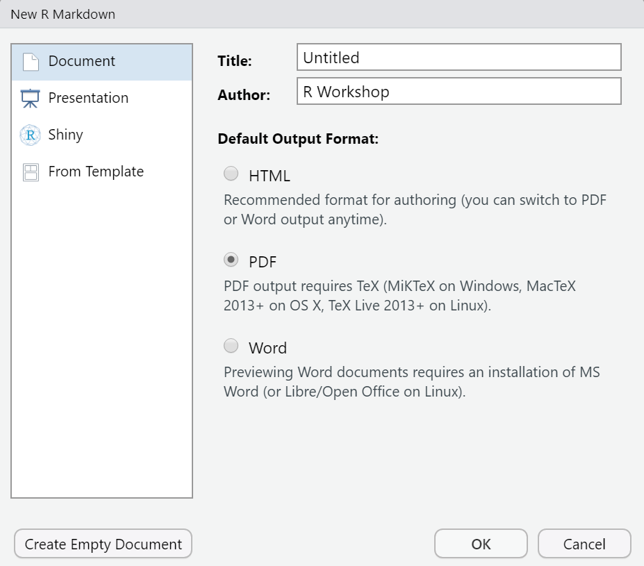
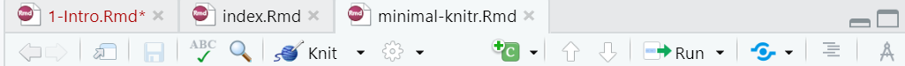

## What do you use to write? 

- Microsoft Word 
- LaTeX / Overleaf
- Pages 
- Google Docs 
- Others? 

How do you get your results from `R` into those documents? 

---

## Knit what?

- Adds (knits) R code into your document so that all of the files for a particular experiment are in one place

- Compiling the document also runs the R code, so one button press runs your statistical analysis and places it into your document

- Integrates R output with the document text so that pictures, tables, and numeric data are all dependent on the R code

- Produces beautiful, seamless  integration of statistical analysis with scientific writing

---

## Reproduceable Research

- Journals often require code and data to be included in a paper submission so the analysis can be reproduced

- Statistical analyses are often re-used for multiple similar experiments

- We don't always comment code when we write it - knitr provides context for the code by including the writeup with the code

---

## What is *R* Markdown?

* Straight from the [R Markdown home page](http://rmarkdown.rstudio.com/):

* R Markdown documents are fully reproducible. Use a productive *notebook interface* to weave together narrative text and code to produce elegantly formatted output. Use multiple languages including `R`, Python, and SQL.

A lot of what is presented here can be found on the [R Markdown Cheatsheet](https://www.rstudio.com/wp-content/uploads/2015/02/rmarkdown-cheatsheet.pdf). 

---

## Markdown doesn't natively support...

- Some appearance related things e.g. image/figure alignment and text coloring require HTML or LaTeX. 

## There is hope...

- You don't *have to* restrict yourself to markdown. You can always include HTML/`LaTeX` markup, but don't expect it to convert between output formats.

- There are many efforts to extend Markdown (often requires a little css or html knowledge)

- More features are added and more templates created all the time! 

- Example: see the `rticles` package for PLOS, PNAS, Elselvier, and many, many other journal templates.  


---
## Setup

- LaTeX: If you don't have this installed, you will need to use our computers.

- knitr: use install.packages("knitr") to install the knitr package in R

- RStudio: File -> New File -> R Markdown (This tells RStudio to use knitr to compile the document)

```{r, echo=FALSE, out.height="50%", out.width="60%"}

```


---

## Contents of a .Rmd

1. The YAML front matter
2. The markdown
3. Code chunks

---
## YAML Front Matter

The stuff at the top of the .Rmd file (called YAML front matter) tells **rmarkdown** what output format you want. 

```
---
title: "How to Not Age"
author: "Paul Rudd"
date: "December 30, 2021"
output: html_document or pdf_document
---
```

In this case, when you click "Knit", RStudio calls `rmarkdown::render("file.Rmd", html_document())`. You can certainly change these default values. 

---
## What is a code chunk?

A code chunk is a concept borrowed from the [knitr](http://yihui.name/knitr/) package (which, in turn, was inspired by [literate programming](http://en.wikipedia.org/wiki/Literate_programming)). In .Rmd files, you can start/end a code chunk with three back-ticks. knitr knows that text is R code if it is included in a chunk.


````
```{r, eval=TRUE}`
1 + 1
```
2
````



---
## Markdown

Any writing, written using the Markup syntax 

```
This is a really smart sentence you wrote. 

### You can Bold your headers

You also emphasize *important* words. 
```
This is a really smart sentence you wrote. 
### You can Bold your headers
You also emphasize *important* words.


---
## Example 

Open minimal-knitr.Rmd in R Studio and compile it. 

Hint: Use the "Knit" button at the top of the text window in R studio


---
## Your Turn!

Change minimal-knitr.rmd so that the second code chunk (named 'boring-random') generates 30 random numbers and computes their sum. 

Make sure the code chunk compiles!

---
## Adding Graphs to Documents with Knitr

```{r chunk-label}` $\\$
make a plot here
```
Plot Output
````
```{r plot_example, fig.height=4.5}
set.seed(1121)
x=rnorm(20)

boxplot(x)

```


---
## Your Turn!

Add a new code chunk to minimal-knitr.Rmd that generates a sample of 50 observations from a normal distribution and plot a histogram. 

```{r, eval=FALSE}
x <- rnorm(50)

library(ggplot2)
qplot(x, geom = "histogram")
```


---
## knitr Code Chunk Options

We may want to remove the messages (the italic text) from our R output in the pdf. Or, we might not want to show the code at all. $\\$

knitr has options to give you greater control over what is shown in the compiled document. 

Let's look at these options in [the documentation](https://yihui.org/knitr/options/) 

---
## knitr Code Chunk Options

- eval=FALSE: dont run the code

- echo=FALSE: don't show the code

- warning=FALSE: don't add R's warninigs to the pdf

- message=FALSE: don't show messages from R in the pdf

- include=FALSE: don't include any R output in the document. 

- tidy=FALSE: don't tidy code of change spacing

- cache=FALSE: re-run all of the code every time.

---
## Your Turn!

Explore some of the options in knitr code chunks:
- Turn off messages and warnings for the histogram we generated last time

- Experiment with tidy=TRUE. What changes occur?

- Can you make knitr show onlly the plot, without code, messages, errors, etc.?

---
## Common Options for Figures

- fig.width = 7, fig.height=7: dimensions of the saved image

- out.width = '\\\textwidth', out.height = '300px': dimensions of the image in the LaTex document. $\\$
Note: $\backslash\backslash$ must be used to generate a single slash in LaTex

- fig.path = "path/to/save/figures": Change where figures are stored

- dpi=72: resolution of the saved image

- fig.keep="all": Which figures to keep $\\$
Options: 'high', 'none', 'all', 'first', 'last'

- fig.show="asis": how to arrange plots $\\$
Options: 'asis', 'hold', 'animate', 'hide'

- fig.cap="caption text": Text for figure caption

- fig.align="center": Alignment of the figure on the document page. $\\$
Options: 'left', 'right', 'center'


---
## Your Turn!

- Generate both a histogram and a density plot in the same code chunk.
  + Try different fig.keep and fig.show options
  
- Change the size of both plots so they will fit on the same page. $\\$
Hint: use out.width=".48\\\text.width"

- Give your figure a caption


---
## Setting Commonly used Options for all chunks

It is common to create a setup chunk at the beginning of a markdown document (usually the first code chunk) to load packages and set default options (if want to apply code chunk options to the whole document).

````
{r, include=FALSE}
knitr::opts_chunk$set(
  Globally applied chunk options
)

````
---
## Mathmode

`$x + 2$` for inline math: $x + 2$

`$$` `x+2` `$$`  for centered paragraph math 
$$x + 2$$
`$\frac{1}{2}$` to create a fraction $\frac{1}{2}$

`\begin` `{align} x &= a + b\\ y &= c + d` `\end{align}`    
for systems of equations

$\begin{align} x &= a + b\\ y &= c + d\end{align}$

`\alpha, \beta, \gamma, \infty, \rightarrow, \int,\frac{a}{b}` 
$$\alpha,\beta,\gamma,\infty,\rightarrow,\int,\frac{a}{b}$$

[Cheatsheet for math mode](http://tug.ctan.org/info/undergradmath/undergradmath.pdf)

[Detextify](https://detexify.kirelabs.org/classify.html) - Fast way to figure out LaTex code for symbols. 

---
## Your Turn!

See if you can this out in R markdown using Mathmode:

$$x = \frac{-b\pm\sqrt{b^{2} - 4ac}}{2a}$$ 

Make sure it compiles in your document!

---
## Tables with kableextra


```{r}
#install.packages(kableExtra)
library(kableExtra)
kable(head(iris), caption = "Demo Table") %>%
  kable_styling(latex_options = "striped")

```

[More Styling Options](https://bookdown.org/yihui/rmarkdown-cookbook/kableextra.html)

---

## Including Pictures Way 1

`knitr::include_graphics("File path to Picture")`

```{r}

```


---

## Including Pictures Way 2

```` $\\$
````


---

## Your Turn!

- Include a Picture in your R markdown file

- Create a table of a dataframe in your R markdown file. Play with the different styling options of the table. (For example change the background color of a row to highlight that row in your table)

---

## Other things that you can do!

- Create slide shows with R markdown
  + [Website for more Info](https://rmarkdown.rstudio.com/lesson-11.html)
- Bookdown and Blogdown for creating books and webpages, respectively.
  + [Bookdown Website](https://bookdown.org/)
  + [Blogdown Website](https://bookdown.org/yihui/blogdown/)


<!-- Other possible topics for later in the workshop:  
  - rmarkdown vs. knitr (one uses pandoc, the other uses latex directly) **Emily and I don't actually understand these things and are confused. I know how to create a document not necessarily why one creates**
  - rticles for journal formats 
  - creating slide shows and word documents with rmarkdown 
  - mention bookdown and blogdown for creating books and webpages, respectively. Also mention Emily's thesisdown mod for UNL :)
-->
