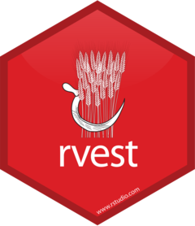
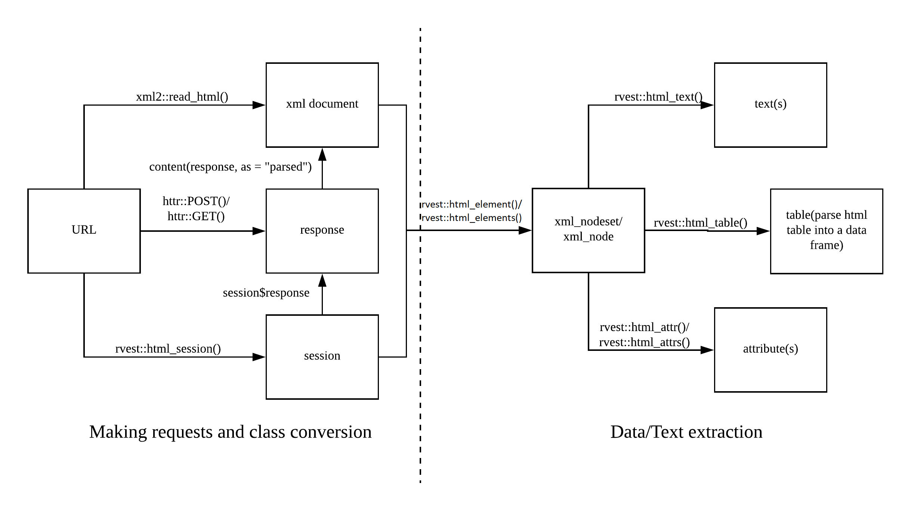

[**Return to rwrks homepage**](http://unl-statistics.github.io/R-workshops/)

Read data in from the internet using packages like `rvest`. Learn to navigate HTML and XML structured data files, and convert data stored in these files into tabular data more commonly used in statistical analyses.

 
 

 

At the end of Web Scraping in R using rvest, we expect our students to be able to understand the following:

+ Understand the general structure of HTML web pages
+ Use CSS and XPATH to navigate HTML pages and select HTML nodes & Extract data from HTML nodes
+ Calling APIs and other programmatic methods of accessing web-based data.

 
 

 

## Timetable

Time | Notes | Lectures and Resources
---- | ---- | ----
1:00-1:30 | [Intro & HTML Intro](knitr/1-WebscrapeIntro.html)  | Understand the structure of HTML web pages (DOM, tags, attributes) [Setup.R](code/0-Setup.R)
1:30-2:45| [XPATH & Data Extraction](knitr/2-XPATH.html)  | Use CSS and XPATH to navigate HTML pages and select HTML nodes & Extract data from HTML nodes
2:45-3:00| **Break** |
3:00-4:00| [Web APIs and Accessing Web-based Data](knitr/3-WebAPIs.html) | Use APIs and other programmatic methods of accessing web-based data

## Solutions
+ [YourTurnSolutions.R](code/99-YourTurnSolutions-2022.R)

<!-- ## Notes and Resources

[Notes](knitr/1-WebScraping.html) -->

### Useful Links

+ [rvest reference guide](https://rvest.tidyverse.org/)
+ [rvest tutorial by Hadley Wickham](https://www.rstudio.com/blog/rvest-easy-web-scraping-with-r/)
+ [JSON and jsonlite Quick Start](https://cran.r-project.org/web/packages/jsonlite/vignettes/json-aaquickstart.html)

<!-- [Minimal knitr Example](code/minimal-knitr.Rmd) -->
