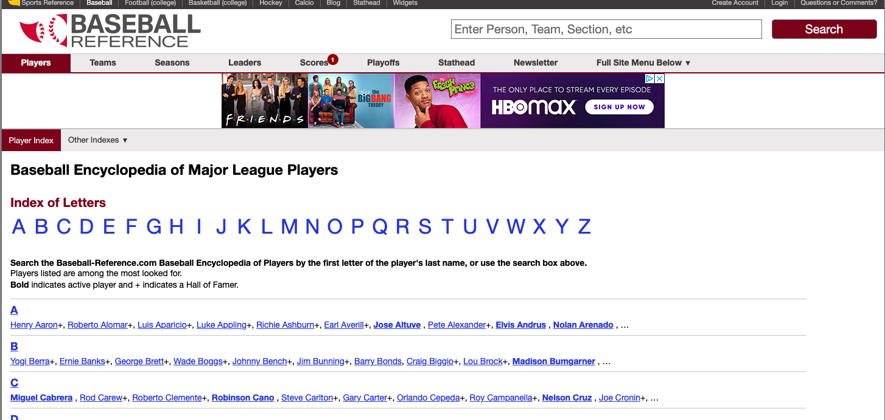

```{r setup, include=FALSE}
knitr::opts_chunk$set(echo = TRUE)
library(tidyverse)
library(httr)
library(rvest)
library(rvest)
library(magrittr)
```


## A web of data

- In 2008, [an estimated](https://sirrice.github.io/files/papers/webtables-vldb08.pdf) **154 million HTML tables** (out of the 14.1 billion) contain 'high quality relational data'!!!
- Hard to quantify how much more exists outside of HTML Tables, but there is [an estimate](https://cs.uwaterloo.ca/~x4chu/SIGMOD2015_1.pdf) of **at least 30 million lists** with 'high quality relational data'.
- A growing number of websites/companies [provide programmatic access](http://www.programmableweb.com/category/all/apis?order=field_popularity) to their data/services via web APIs (that data typically comes in XML/JSON format).

## Before scraping, do some googling!

- If resource is well-known (e.g. Twitter, Fitbit, etc.), there is *probably* an existing R package for it.
- [ropensci](https://ropensci.org/) has a [ton of R packages](https://ropensci.org/packages/) providing easy-to-use interfaces to open data.
- The [Web Technologies and Services CRAN Task View](http://cran.r-project.org/web/views/WebTechnologies.html) is a great overview of various tools for working with data that lives on the web in R.

---

## A web of *messy* data!

- Recall the concept of [tidy data](http://vita.had.co.nz/papers/tidy-data.pdf).
- Data is in a table where
    * 1 row == 1 observation
    * 1 column == 1 variable (observational attribute)
- Parsing web data (HTML/XML/JSON) is easy (for computers)
- Getting it in a tidy form is typically *not easy*.
- Knowing a bit about modern tools & web technologies makes it *much* easier.

---

## What is webscraping? 

- Extract data from websites 
    + Tables
    + Links to other websites
    + Text
    
```{r echo=FALSE, out.width='33%', fig.show='hold', fig.align='default'}
knitr::include_graphics(c('./images/gdpss.png','./images/cropsss.png','./images/gass.png'), auto_pdf = FALSE)
```    

---

## Why webscrape? 

>- Because copy-paste is awful 
```{r echo=FALSE, out.width='50%'}
knitr::include_graphics("./images/copypastesucks.png", auto_pdf = FALSE)
```
>- Because it's fast
>- Because you can automate it

---

## SelectorGadget

+ SelectorGadget is a javascript bookmark let to determine the css selectors of pieces of a website we want to extract.
+ Bookmark the SelectorGadget link, https://rvest.tidyverse.org/articles/selectorgadget.html, then click on it to use it (or add the chrome extension)
+ When SelectorGadget is active, pieces of the website are highlighted in orange/green/red.
+ Use SelectorGadget on http://www.baseball-reference.com/players/.
+ Read more details on vignette("selectorgadget")

If you prefer, you can also read the HTML code and create your own [CSS](https://www.w3schools.com/cssref/css_selectors.asp) or [XPATH](https://www.w3schools.com/xml/xpath_syntax.asp) selectors. (This is what I do usually -- it's a bit more precise)




---

## SelectorGadget Results 

```{r}
url <- "http://www.baseball-reference.com/players/a/"
html <- read_html(url)
html %>% html_nodes("strong a") %>% html_text()
```


