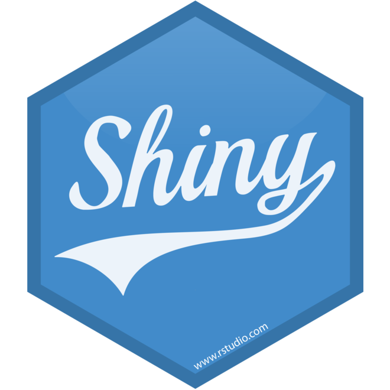

[**Return to rwrks homepage**](http://srvanderplas.github.io/rwrks/)

 
 

 

The Interactive R Applets with Shiny workshop will teach you how create interactive web applets that allow users to interact with your data and statistical analyses in a user-friendly setting. These applets are fantastic for teaching, but are also useful for reporting your data interactively. In addition, they are also very simple to create, and you don't have to know how to use HTML and JavaScript to make them! Learn how to combine the statistical power of R with user-friendly, interactive webpages in this 3-hour session.

The course will be very hands-on: after we show you the basics of Shiny, we will spend the remainder of the workshop helping you create your very own applet to take home. If you have data and graphics you would like to make into an interactive applet, bring them with you; otherwise, we will provide some interesting data for you to work with during the workshop. It will be held in a computer lab but you are encouraged to bring your own laptops, with software already loaded. A list of software will be available at this site several days prior to the workshop.

## Timetable

Time | Notes | Lectures and Resources
---- | ---- | ----
9 - 9:45 | [Setup and Introduction to Shiny](knitr/1-Setup.html) | This will make sure that everybody's system is up and running, and introduce you to Shiny   **You should try to install Rstudio and shiny ahead of time, so that this time can be used to address potential problems.**   [apps.zip](code/apps.zip)
9:45 - 10:30 | [Structure of a Shiny Applet](knitr/2-ShinyStructure.html) | Learn about reactive programming and how to create a bare-bones shiny applet
10:30 - 12:15 | [Workshop: Create your own Shiny Applet](knitr/3-ShinyTools.html) | Learn about the input and output options Shiny provides, and then create your own Shiny applet!
12:15 - 12:30 | Questions and Survey | We very much appreciate any feedback you can give us. You can find a form here: [survey](https://docs.google.com/a/iastate.edu/forms/d/e/1FAIpQLSdj4YEa46XY2nDG_iP7s0VAYwihzIGGSo5wFP73wq3t7NhzYA/viewform?usp=sf_link).

## Solutions

+ [yourturn.zip](code/yourturn.zip)

## Useful Links

### Resources

+ [Shiny cheatsheet](https://shiny.rstudio.com/images/shiny-cheatsheet.pdf)
+ [Mastering Shiny](https://mastering-shiny.org/) by [Hadley Wickham](https://hadley.nz/)

### Recommended Reading

+ [RStudio Tutorial for Shiny](https://shiny.rstudio.com/tutorial/) Much of today's material is borrowed from this tutorial
+ [Shiny Setup, Showcase, and Server setup](https://shiny.rstudio.com/) Useful if you want to use shiny on your own webserver
+ [Shiny Github Page](https://github.com/rstudio/shiny) See the latest updates
+ [Shiny Mailing List](https://groups.google.com/g/shiny-discuss) Check the tutorial first, then search the mailing list.