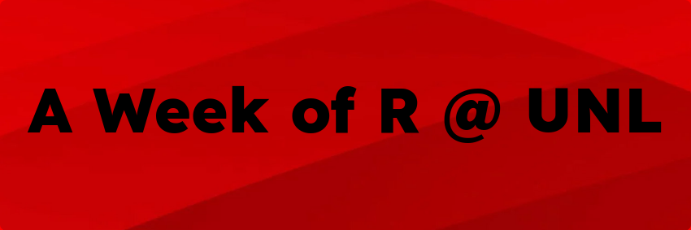

================

[Join our Google Group for updates and future course
announcements](mailto:R-at-UNL+subscribe@googlegroups.com?Subject=subscribe-github)

# R Workshops

## January 2022 - A Week of R

\*\* Schedule is tentative and subject to change due to enrollment and
lab availability \*\*

| Date       |    Time    | Course                                         | Description                                                                                                                                                                                                                                                                                                                                                                                                                                                                                                                                                                                                       |
|------------|:----------:|------------------------------------------------|-------------------------------------------------------------------------------------------------------------------------------------------------------------------------------------------------------------------------------------------------------------------------------------------------------------------------------------------------------------------------------------------------------------------------------------------------------------------------------------------------------------------------------------------------------------------------------------------------------------------|
| January 10 | 9am - 4pm  | Introduction to R                              | Learn the basics of R & Rstudio, how to write your own R scripts and get an introduction to the tidyverse. We’ll start with the beginning and quickly get you up to speed with the basic tools of data exploration. You will learn how to import and manage data sets, create R objects, install and load R packages, and how to ask for help in R.                                                                                                                                                                                                                                                               |
| January 11 | 9am - 4pm  | Graphics with `ggplot2`                        | `ggplot2` gives a framework to produce elegant, high-end graphical displays following the technical framework of the Grammar of Graphics. You will learn how to create a wide variety of graphical displays in R. We will use a lot of data examples to work through the basic plots as well as more advanced tools, such as faceting, colors, themes and more. We will end the day with interactive & animated graphics in R.                                                                                                                                                                                    |
| January 12 | 9am - 4pm  | Data Wrangling                                 | This workshop will to prepare you for dealing with messy data by walking you through real-life examples. We will work on improving your programming skills and help you move beyond using copy-and-paste. We will discuss how to write functions in order to reduce duplication in your code and automate common tasks and how to use iteration in order to further reduce duplication. You will leave with skills that will allow you to both tackle problems with more ease.                                                                                                                                    |
| January 13 | 9am - 12pm | Dynamic Documents with `knitr` and `rmarkdown` | Create reports and write papers using R! Let R do the heavy lifting so that you can focus on the content - use R to assemble your data and `knitr` or `rmarkdown` to produce reports which integrate graphs and conclusions from your data automatically. Whether you are writing business reports or journal articles, `knitr` and `rmarkdown` are extremely valuable tools to use to make your life easier!                                                                                                                                                                                                     |
| January 13 | 1pm - 4pm  | Web Scraping                                   | Read data in from the internet using packages like `rvest`. Learn to navigate HTML and XML structured data files, and convert data stored in these files into tabular data more commonly used in statistical analyses.                                                                                                                                                                                                                                                                                                                                                                                            |
| January 14 | 9am - 12pm | Interactive applets with Shiny                 | Learn how to create interactive, web-based applets entirely within R! The shiny package allows us to create interactive applets for teaching, data analysis, or publication, without requiring knowledge of HTML or JavaScript!. See some of the fantastic applets in the [Shiny showcase](https://shiny.rstudio.com/gallery/), and learn how to create applets of your own in our workshop.<br/>This session is designed as a workshop, so bring your data and analysis code, and leave with a Shiny applet! (If you don’t have data you’d like to use for this, we’ll provide you with some data to play with!) |

## Learning Outcomes

After the end of the this one week course, we expect you to be able to
do the following:

<details>
<summary>
Introduction to R
</summary>

-   Use R for scientific/statistical calculations
-   Be able to create or read in data
-   Be able to manipulate data using common patterns
-   Explore data set characteristics and calculate summary statistics
    for real data sets
-   Use the help functionality to find the functions you need to do what
    you want to do
-   Install, use, and search for helpful external packages

</details>
<details>
<summary>
Graphics with <code>ggplot2</code>
</summary>

-   Visualize data using the ggplot2 package
    -   create basic plots
    -   understand the layer system
    -   be able to structure complex graphics
-   Take a dataset and use static graphics to look for interesting
    features.
-   Know about some aspects of human perception and what to avoid when
    plotting data.

</details>
<details>
<summary>
Data Wrangling
</summary>

-   Read data into R from different formats
-   Investigate and work with different types of objects
-   Use `dplyr` verbs such as summarize, group_by, mutate, filter, and
    select to modify and summarize data
-   Use `tidyr` to convert data to wide and long formats, join related
    data sets, and clean messy data

</details>
<details>
<summary>
Dynamic Documents with <code>knitr</code> and <code>rmarkdown</code>
</summary>

-   Create documents that incorporate R code, R output, and text
-   Write documents using markdown or LaTeX
-   Use templates to structure markdown output into pdf, html, and docx
    formats
-   Create slides using markdown and/or LaTeX with R output

</details>
<details>
<summary>
Web Scraping
</summary>

-   Understand the structure of HTML web pages (DOM, tags, attributes)
-   Use CSS and XPATH to navigate HTML pages and select HTML nodes
-   Extract data from HTML nodes
-   Use APIs and other programmatic methods of accessing web-based data

</details>
<details>
<summary>
Shiny
</summary>

-   Design a user interface
-   Create R code to respond to interactive elements of the UI
-   Connect the user interface to reactive R code to create an
    interactive applet

</details>

# Sign Up

~~[Register](https://forms.gle/KXeetJvppY9uFuJv9)~~ Coming soon!

## Pricing

These workshops are developed and hosted by graduate students in the
Statistics department at University of Nebraska-Lincoln, primarily to
assist UNL students and staff with developing R skills necessary for
research and data analysis. Individuals from outside the university are
welcome to participate. Proceeds from the workshops directly fund
graduate student activities.

| Workshop Type | Student | UNL Affiliate | Corporate |
|---------------|---------|---------------|-----------|
| Full Day      | $20     | $40           | $180      |
| Half Day      | $10     | $20           | $90       |
| Full Week     | $90     | $180          | $810      |

If you are anticipating registering several people as a group, please
feel free to contact [Susan
Vanderplas](mailto:svanderplas2@unl.edu?subject=R%20Workshops%20Pricing)
for a group rate.

# First Day Setup!

You will need to bring a laptop with the following software installed:

-   [R](https://cloud.r-project.org/) (version 4.0.0 or greater)
-   [RStudio](https://www.rstudio.com/products/rstudio/download/#download)
    (version 2021.09 or greater)
-   \[Windows only\]
    [Rtools](https://cloud.r-project.org/bin/windows/Rtools/)
-   In R, please run the following code:

``` r
# this will take a LONG time...
install.packages(c("knitr", "rmarkdown", "tidyverse", "rvest", "xml2", "tinytex")) 

tinytex::install_tinytex()
```

You will need to make sure that you have sufficient permissions on your
machine to install R packages from CRAN. If you do not have admin access
to your own machine, please work with your administrator to ensure that
you can install R packages during the workshop if necessary, as this is
an important skill to learn.
